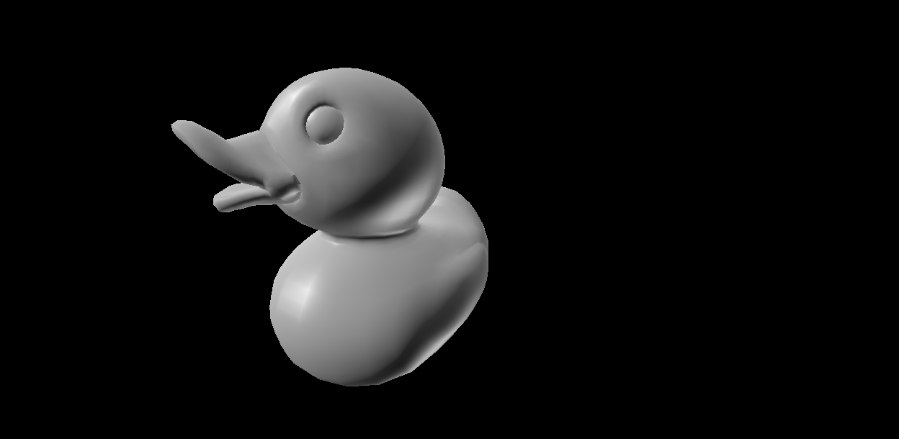
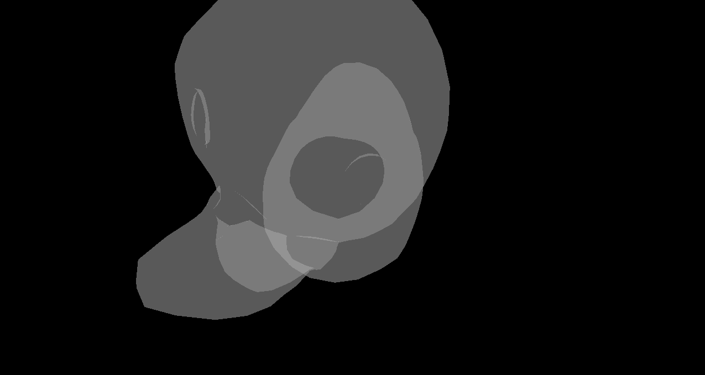
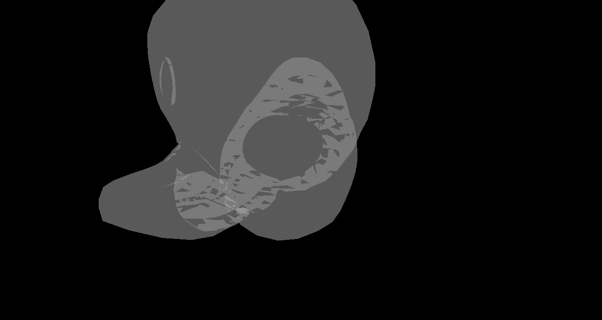

CUDA Rasterizer
===============

**University of Pennsylvania, CIS 565: GPU Programming and Architecture, Project 4**

* Mariano Merchante
* Tested on
  * Microsoft Windows 10 Pro
  * Intel(R) Core(TM) i7-6700HQ CPU @ 2.60GHz, 2601 Mhz, 4 Core(s), 8 Logical Processor(s)
  * 32.0 GB RAM
  * NVIDIA GeForce GTX 1070 (mobile version)
  
## Details
This project implements a hierarchical tiled rasterizer in CUDA. It subdivides the screen multiple times and stores polygon data at different levels to optimize memory usage, and then traverses through this hierarchy when rendering.

A video can be found [here](https://vimeo.com/238739035)

## Rasterization
The rasterization aspect is very similar to other approaches, with the difference that instead of iterating through all primitives and doing scanline rasterization, it follows these steps:

- Builds a tile data structure that contains all hierarchy levels and enough memory for primitive indices.
  - It uses a logarithmic scale to increase the primitive capacity as the tile becomes bigger.
- On each frame:
  - Clears every tile primitive counter
  - Iterates over all primitives and stores them at the correct level on the hierarchy. It uses an atomic counter to keep track of how many primitives the tile must render. To select which level to store the primitive, it checks with how many tiles it intersects.
  - Rasterizes each tile, iterating through all found primitives and up through the hierarchy until the biggest level is reached.
    - Note that because each tile is running in parallel, z testing has no race condition and thus can be trivially done in the tile kernel.
    
Because most of the effort was put into the tiled rendering approach, no fancy methods such as texturing, AA or image effects were implemented, given that these are usually trivial.
    
## Specific optimizations

- Backface culling
- Early Z-reject 
- Pineda algorithm for triangle rasterization

# Overdraw and early rejection
Note that when early rejection is enabled, primitive overdraw is reduced because triangles are discarded before doing per fragment z-testing.

Overdraw without early reject

Overdraw with early reject
   
## Results
This approach seems to be very good when the geometry is balanced throughout different tile levels. If, for example, the full scene can be placed on one small tile, performance can drop dramatically, and can even lose primitives. This can be mitigated by doing multiple passes until all geometry is rasterized, but it is not implemented.

Memory consumption is a big issue too, and the logarithmic scale used for different hierarchy capacities is used to mitigate the fact that as tiles become bigger, more primitives are going to intersect with them. 

As expected, the results are also very dependent on the tile size, the amount of subdivisions, and also the threshold used for placing primitives at specific levels of the hierarchy.

An important distinction is that this approach does not use shared memory, so 16x16 tiles are actually really slow because of global memory access. When tiles are smaller, around 4x4, the algorithm benefits from cache accesses and performance improves drastically.

## Improvements
* The fixed, preallocated primitive memory is not ideal, and maybe extending the atomic counter idea to a dynamic global list may be useful at different hierarchy levels.
* Automatically optimizing certain parameters, such as tile size, subdivision levels, coverage count, etc. for the specified scene data could be interesting.

### Credits

* [tinygltfloader](https://github.com/syoyo/tinygltfloader) by [@soyoyo](https://github.com/syoyo)
* [glTF Sample Models](https://github.com/KhronosGroup/glTF/blob/master/sampleModels/README.md)
